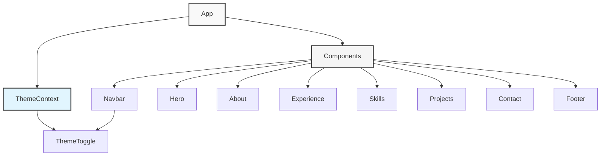
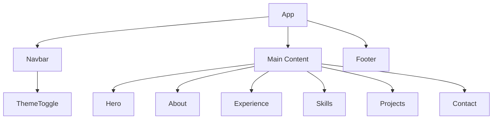

# Portfolio Website Architecture

## Application Structure


## Component Hierarchy
- App (Root Component)
  - ThemeContext (Global Theme State)
  - Navbar
	- ThemeToggle
  - Main Content
	- Hero Section
	- About Section
	- Experience Section
	- Skills Section
	- Projects Section
	- Contact Section
  - Footer

## Data Flow
1. Theme State Management
   - ThemeContext provides global theme state
   - ThemeToggle triggers theme changes
   - Components consume theme context

2. Navigation System
   - Navbar manages navigation state
   - Smooth scroll to sections
   - Mobile responsive menu

3. Component Communication
   - Props down
   - Events up
   - Context for global state

## Technology Stack
- React (UI Library)
- Vite (Build Tool)
- Tailwind CSS (Styling)
- React Icons (Icons)
- React Context (State Management)

## Key Features
1. Responsive Design
   - Mobile-first approach
   - Breakpoint system
   - Fluid typography

2. Theme System
   - Light/Dark mode
   - System preference detection
   - Theme persistence

3. Performance
   - Code splitting
   - Optimized assets
   - Minimal dependencies

4. Accessibility
   - ARIA labels
   - Keyboard navigation
   - Color contrast compliance

## Component Structure


## Theme System
- Uses React Context API for global theme state
- Supports system preferences
- Persists user preference in localStorage
- Implements CSS classes via Tailwind's darkMode

## Key Features
1. Responsive Design
   - Mobile-first approach
   - Breakpoint system
   - Fluid typography

2. Performance
   - Code splitting
   - Image optimization
   - Minimal dependencies

3. Accessibility
   - ARIA labels
   - Keyboard navigation
   - Color contrast compliance

4. State Management
   - React Context for theme
   - Local state for forms
   - Controlled components

## File Structure
```
src/
├── components/        # React components
├── context/          # Global state management
├── assets/           # Static assets
├── styles/           # Global styles
└── utils/           # Helper functions
```

## Technology Stack
- React 18
- Vite
- Tailwind CSS
- Context API
- Local Storage